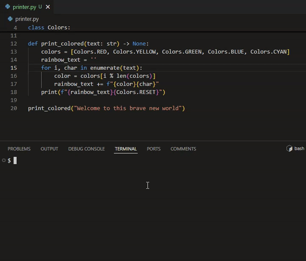

# Reloady
A hotreload cli that automatically reexecutes python files when it detects changes

Port of [Jesper's SourceChangeMonitor.py](https://jesper.borgstrup.dk/2011/10/restart-python-program-if-source-has-been-modified/) to python 3

~~Instructions on how to use are [here](https://jesper.borgstrup.dk/2011/10/restart-python-program-if-source-has-been-modified/)  ( or on [Wayback machine](https://web.archive.org/web/20200804150140/https://jesper.borgstrup.dk/2011/10/restart-python-program-if-source-has-been-modified/),  just in case.. )~~


## Installation

```bash
pip install reloady
```

## Use cases

This package is a command line tool that can be used to automatically restart a python program when it detects changes in the source code.
It is designed to be used in development environments where you want to make changes to your code and see the results immediately without manually restarting the program.
Some examples use cases are:
 - competitions where you want to make changes to your code and see the results immediately.
 - training for problems on [leetcode](https://leetcode.com/) or [codewars](https://www.codewars.com/) where you want to make changes to your code and see the results instantly.
 - debugging problems in a running program by making changes to the code and seeing the results immediately.
 - visualizing the output of a program in real time.
 [examples/printer.py](./examples/printer.py) is an example of a program that visualizes the output of a program in real time.





P.S. cli command has been renamed from `pyreload` to `reloady`


## Usage
```bash
reloady your_program.py
```

## with arguments
```bash
reloady main.py arg1 arg2
```

## examples

### [Two Sum](https://leetcode.com/problems/two-sum/) problem
```bash
cd examples/two_sum
reloady main.py
```
In this example, the program will automatically restart when changes are detected in either `main.py` or `two_sum.py`.
`main.py` will test all cases in `input.txt` and compare the output with `output.txt`.


### [Colored Text](./examples/printer.py) example
```bash
cd examples/printer
reloady main.py
```
In this example, the program will automatically restart when changes are detected in either `main.py` or `printer.py`.

It is usefule to see how the colored text will look like without having to run the program manually for each change.
